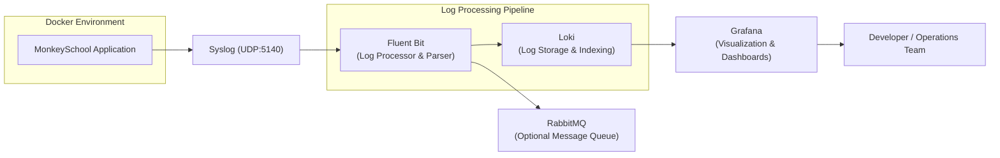

# ADR-006: Telemetry Pipeline Architecture Using Docker Logging Driver, Fluent Bit, and Grafana

**Status:** Accepted  
**Date:** 2025-12-10  
**Authors:** Lillian Liu, Juan Yin, Team Members  
**Version:** 1.0  

## Context

Our backend application (`monkeyschool-app`) runs inside a Docker environment and outputs logs through standard output and syslog. To support observability, debugging, and operational insight, we require a telemetry pipeline that can:

- Capture logs produced inside Docker containers and from syslog sources
- Route them through a reliable and configurable log processor  
- Enable visualization of system behavior in real-time with efficient querying
- Provide long-term log storage with built-in indexing capabilities
- Optionally forward log messages to external systems (e.g., message queues)

Previously, TimescaleDB was considered for long-term log storage, but has been removed to reduce operational overhead. The current implementation focuses on a streamlined pipeline optimized for development efficiency and ease of implementation.

Key constraints and goals include:  
- Use lightweight, Docker-compatible logging tools  
- Minimize setup complexity while maintaining powerful querying capabilities
- Enable efficient log filtering and parsing for HTTP access logs
- Support future integration with RabbitMQ  
- Provide native Grafana integration for visualization

## Decision

The project implements the following telemetry pipeline:

### Logging Flow
1. **Application Logs → Syslog (UDP Port 5140)**  
   The application writes logs to syslog, which are captured by Fluent Bit's syslog input plugin.

2. **Fluent Bit (Log Processing & Filtering)**  
   - Receives logs via syslog UDP input on port 5140
   - Applies regex filtering to process only HTTP access logs (`.*HTTP/1\.1`)
   - Parses logs using custom HTTP parser (`http_strict`)
   - Transforms logs to JSON format for structured storage
   - Routes processed logs to Loki

3. **Loki (Log Storage & Indexing)**  
   - Stores logs with efficient indexing using TSDB schema
   - Provides filesystem-based storage for development simplicity
   - Enables fast querying with label-based indexing
   - Runs on port 3100 with embedded cache for performance

4. **Grafana (Visualization & Dashboards)**  
   - Connects directly to Loki as data source
   - Provides real-time log visualization and querying
   - Runs on port 3001 to avoid conflicts with main application
   - Native LogQL support for advanced log queries

5. **RabbitMQ (Optional Message Queue)**  
   Available for future asynchronous log routing if needed.

## Alternatives Considered

### Log Storage Solutions

| Alternative | Pros | Cons |
|------------|------|------|
| Loki (chosen) | Native Grafana integration, lightweight, efficient indexing, fast setup | Limited advanced analytics compared to full-text search engines |
| TimescaleDB | Excellent for time-series data, SQL queries | Requires additional SQL knowledge, more complex setup |
| Elasticsearch + ELK | Powerful full-text search, mature ecosystem | Heavy resource usage, complex configuration |

### Log Processing

| Alternative | Pros | Cons |
|------------|------|------|
| Fluent Bit (chosen) | Lightweight, efficient parsing, extensive output plugins | Less complex transformations than alternatives |
| Logstash | Very powerful transformation capabilities | Heavy resource usage, Java-based |
| Vector | High performance, modern architecture | Less mature ecosystem |

### Visualization

| Alternative | Pros | Cons |
|------------|------|------|
| Grafana (chosen) | Native Loki integration, excellent dashboards, LogQL support | Primarily designed for metrics, learning curve for logs |
| Kibana | Deep Elasticsearch integration, powerful log analysis | Requires Elasticsearch stack |
| Custom UI | Fully customizable | Significantly more development time |

## Architecture Diagram

## Implementation Details

### Fluent Bit Configuration
- **Input**: Syslog UDP on port 5140 with custom parser
- **Filtering**: Regex filter for HTTP access logs (`.*HTTP/1\.1`)  
- **Parsing**: Custom HTTP parser (`http_strict`) for structured log extraction
- **Output**: JSON-formatted logs to Loki with app labels

### Loki Configuration  
- **Storage**: Filesystem-based with TSDB schema for efficient indexing
- **Performance**: Embedded cache (100MB) for query optimization
- **Schema**: v13 with 24-hour index periods
- **Labels**: App-based labeling for efficient querying

### Grafana Integration
- **Data Source**: Native Loki connection
- **Port**: 3001 (avoiding main app port conflicts)
- **Query Language**: LogQL for advanced log filtering and analysis

## Consequences

### Positive
- **Development Efficiency**: Loki provides immediate log storage and querying without complex database setup
- **Native Integration**: Seamless Grafana-Loki integration reduces configuration overhead  
- **Performance**: Efficient log indexing and caching enable fast query responses
- **Lightweight Architecture**: Minimal resource footprint suitable for development environments
- **Structured Logging**: JSON output format enables rich querying capabilities
- **Time-Saving**: Quick implementation allows focus on application development rather than infrastructure

### Negative
- **Limited Analytics**: Less powerful than full-text search solutions for complex log analysis
- **Storage Limitations**: Filesystem storage may require migration for production scale
- **Query Language**: LogQL learning curve for team members unfamiliar with Grafana

### System-wide Impact
- **Improved Debugging**: Real-time log visualization accelerates issue resolution
- **Operational Visibility**: Structured HTTP access log monitoring
- **Scalable Foundation**: Architecture supports future migration to production-grade storage
- **Development Velocity**: Simplified setup reduces time-to-value for telemetry insights

### Future Improvements
- Migrate to object storage (S3/GCS) for production deployments
- Add alerting rules and SLA monitoring in Grafana
- Implement log retention policies and archival strategies
- Expand parsing rules for additional log formats beyond HTTP access logs
- Add metrics collection pipeline alongside log processing

## Rationale for Loki Selection

**Convenience for Current Development**: Loki was chosen specifically because it provides immediate value with minimal setup complexity. Unlike TimescaleDB or Elasticsearch, Loki requires no database schema design or index management.

**Time-Saving Implementation**: The native Grafana integration means zero additional configuration for visualization, allowing the team to focus on application features rather than infrastructure complexity.

**Efficient Development Workflow**: LogQL queries provide powerful filtering capabilities without requiring SQL knowledge or complex search syntax, making it accessible to all team members.

## References
- [Fluent Bit Documentation](https://docs.fluentbit.io/)
- [Grafana Loki Documentation](https://grafana.com/docs/loki/)  
- [Grafana Documentation](https://grafana.com/docs/grafana/)
- [LogQL Query Language](https://grafana.com/docs/loki/latest/query/)
- [RabbitMQ Documentation](https://www.rabbitmq.com/documentation.html)