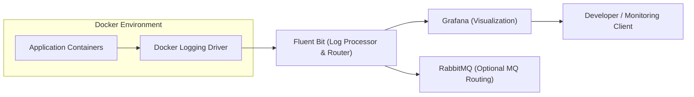

# ADR-006: Telemetry Pipeline Architecture Using Docker Logging Driver, Fluent Bit, and Grafana

**Status:** Accepted  
**Date:** 2025-12-10  
**Authors:** Lillian Liu, Juan Yin, Team Members  
**Version:** 1.0  

## Context

Our backend application (`monkeyschool-app`) runs inside a Docker environment and outputs logs through standard output.  
To support observability, debugging, and operational insight, we require a telemetry pipeline that can:

- Capture logs produced inside Docker containers  
- Route them through a reliable and configurable log processor  
- Enable visualization of system behavior in real-time  
- Optionally forward log messages to external systems (e.g., message queues)  

Previously, TimescaleDB was included for long-term log storage, but it has been removed to simplify debugging and reduce operational overhead during early development.

Key constraints and goals include:  
- Use lightweight, Docker-compatible logging tools  
- Avoid vendor lock-in on heavy storage systems until needed  
- Enable multiple log routes (e.g., HTTP access logs vs. error logs)  
- Support future integration with RabbitMQ  

The intended pipeline matches the architecture shown in the diagram provided by the team.

## Decision

The project will implement the following telemetry pipeline:

### Logging Flow
1. **App Container → stdout**  
   The application writes all logs to stdout using standard container logging practices.

2. **Docker Logging Driver → TCP Forwarding**  
   The host’s Docker logging driver forwards these logs over TCP to a collector.

3. **Fluent Bit (Port 24224)**  
   Fluent Bit receives logs, assigns tags (e.g., `http_access`, `security`, `error`), and routes them based on config.

4. **Grafana (Port 3000)**  
   Grafana is used for visualization dashboards and querying runtime telemetry.

5. **RabbitMQ (Optional)**  
   If configuration succeeds, Fluent Bit may forward specific log streams to RabbitMQ queues.

TimescaleDB has been removed from the current version of the pipeline.

## Alternatives Considered

### Logging & Routing

| Alternative | Pros | Cons |
|------------|------|------|
| Docker Logging Driver → Fluent Bit (chosen) | Lightweight, easy to configure, flexible routing | No built-in long-term storage |
| ELK Stack (Elasticsearch + Logstash + Kibana) | Very powerful indexing and visualization | Heavy resource usage, high operational cost |
| Loki + Promtail + Grafana | Modern, log-focused stack, excellent Grafana integration | Requires redesign of current routing and tagging |

### Visualization

| Alternative | Pros | Cons |
|------------|------|------|
| Grafana (chosen) | Fast dashboards, great ecosystem, easy setup | Requires data source integration |
| Kibana | Deep Elasticsearch integration | Requires Elasticsearch |
| Custom UI | Fully customizable | Significantly more development required |

### Message Queue Integration

| Alternative | Pros | Cons |
|------------|------|------|
| RabbitMQ (optional, chosen) | Reliable message routing, useful for async pipelines | Adds configuration complexity |
| Kafka | Extremely scalable | Much heavier infrastructure |
| No message queue | Simple setup | No asynchronous log routing |

## Architecture Diagram

## Consequences

### Positive
- Lightweight and production-friendly telemetry pipeline  
- Fluent Bit provides flexible routing without requiring TimescaleDB  
- Grafana enables fast visualization  
- Optional RabbitMQ adds future extensibility  
- Docker logging driver keeps logs decoupled from the application container  

### Negative
- Without a long-term storage system (e.g., TimescaleDB, Loki), logs are not persisted indefinitely  
- TCP forwarding may break under load and requires monitoring  
- RabbitMQ integration increases complexity if enabled  

### System-wide Impact
- Simplifies observability during development  
- Enables modular expansion into more advanced telemetry stacks later  
- Improves debugging capabilities without requiring heavy infrastructure  

### Future Improvements
- Add long-term log storage (Loki, Elasticsearch, or TimescaleDB when stable)  
- Improve Fluent Bit tagging and structuring rules  
- Add alerting, thresholds, and metrics-based dashboards in Grafana   

## References
- Fluent Bit Documentation  
- Docker Logging Driver Documentation  
- Grafana Documentation  
- RabbitMQ Documentation  
