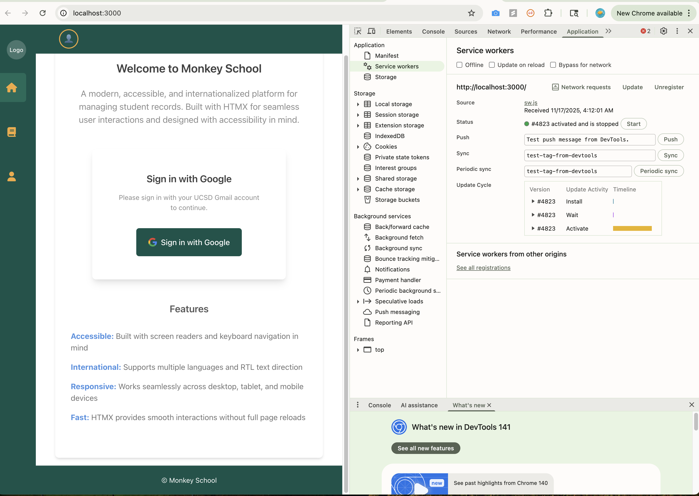
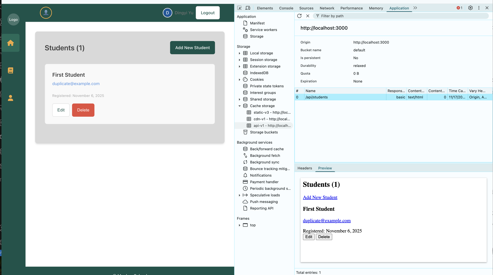
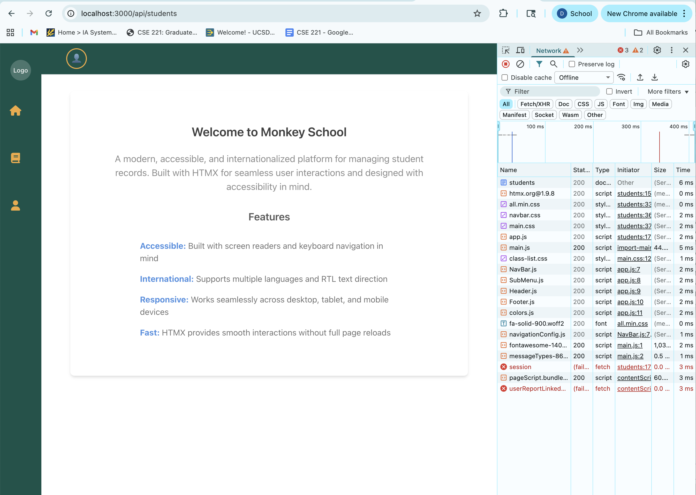

# Service Worker Caching Strategy Documentation

This document describes the caching strategy implemented in the **Monkey School HTMX Web App** using a custom Service Worker.  
The goal is to support **offline navigation**, **fast static asset delivery**, and **offline-first API fallbacks**, while **never interfering with Google OAuth authentication**.

---

## Overview

The Service Worker implements three logical caches:

- **Static Cache (`static-v3`)**  
  Stores the application shell (HTML, CSS, JS, icons, fonts).

- **API Cache (`api-v1`)**  
  Stores API GET responses using a network-first strategy.

- **CDN Cache (`cdn-v1`)**  
  Stores external libraries (HTMX, FontAwesome) using stale-while-revalidate.

The system is optimized to allow the UI to load fully offline, and provide cached API responses when possible.

---

## Installation (Static Precache)

During installation, the Service Worker loads a manifest containing all static assets.  
These assets are precached so that the app shell loads immediately even without network connectivity.

This ensures:

- Initial load speed is very fast.
- Offline navigation still loads the main UI frame.

---

## Activation and Cache Cleanup

When a new Service Worker version installs, old outdated cache entries are removed.

Only the latest versions of:

- `static-v3`  
- `api-v1`  
- `cdn-v1`  

are retained.

This prevents unlimited cache growth and ensures the newest static assets are always used.

---

## Fetch Handling Strategy

The Service Worker applies different strategies depending on the request type.

### 1. **Bypass Authentication Routes**  
`/api/auth/*` requests are **never intercepted**.  
This prevents OAuth redirects (302) from being cached or modified.  
Google login must always hit the network directly.

**Why?**  
Caching or intercepting OAuth redirects breaks login flows.

---

### 2. **SPA Navigation — Serve Cached Shell**
When the browser navigates (`mode="navigate"`), the Service Worker returns the cached `index.html`.

This enables:

- Offline SPA navigation
- Faster cold loads
- Consistent rendering even without network

---

### 3. **API Calls — Network First**

Any request under `/api/*` uses:

**Network → Cache fallback**

Meaning:

- If online: newest data is fetched and cached.
- If offline: cached API response is returned.
- If not cached: an error is shown.

This is ideal for HTMX dynamic pages.

---

### 4. **CDN Assets — Stale-While-Revalidate**

External resources (HTMX, FontAwesome, Google Fonts) use:

**Cache immediately → Update in background**

This ensures:

- Near-instant load times
- Automatic background updates to latest versions

---

### 5. **Static Files — Cache First**

JavaScript, CSS, images, and fonts inside the project use:

**Cache → Network fallback**

This improves reliability and speed.

---

## Offline Behavior

### ✔ Front-end static UI works offline  
Navigation and UI components continue to load via cached assets.

### ✔ API pages may load from API cache  
For example:

- `/api/students`
- `/api/students?page=2`
- `/api/students/:id`

Work offline if a cached entry exists.

### ✖ Authentication does not work offline  
When offline:

- `/api/auth/session` fails  
- App falls back to root UI  

If offline login is desired, a separate **local session persistence** mechanism can be implemented (optional future enhancement).

---

## DevTools Verification
- Static resources load from **Service Worker**  
- API responses load from **Service Worker cache**  
- Offline navigation still renders

